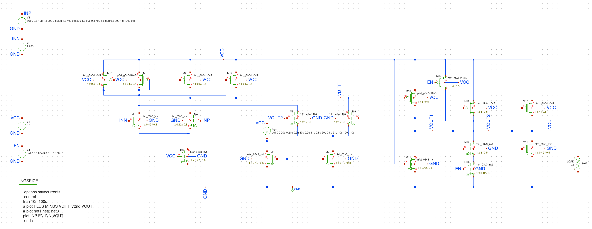

# [Google Skywater 130nm](https://github.com/google/skywater-pdk) Comparator IP

## Introduction
A comparator is a device that compares two analog inputs and outputs a digital signal indicating which input is larger. So it has two analog input terminals and one binary digital output. 
When the difference between two analog input signals approach zero, noise on the inputs will cause spurious switching of digital output. This rapid change in output due to noise can be prevented by hysteresis. Hysteresis is switching the output high or low at different input signal levels. In place of one switching point, hysteresis introduces two: one for rising edge, and one for falling edge of voltage or current. The difference between the higher-level trip value (VH) and the lower-level trip value (VL) equals the hysteresis voltage (HYST).

## Comparator Building Blocks
A comparator can be divided into three distinctive pieces – a frontend differential amplifier, amplifier stage and output stage.

## Comparator Circuit
Below is comparator circuit diagram used for this IP

In the circuit above PLUs and MINUS are differential inputs.
Ihyst is the current used to control the hysteresis.
Vout is the output

The xschem project is in Prelayout folder.
Xschem can be set-up using [this link](https://www.youtube.com/watch?v=jXmmxO8WG8s)

## Simulation
The circuit was simulated at diffent crossing points of PLUS and MINUS voltages. i.e PLUS - MINUS = zero at three different points (0.9 V, 0.6V and 1.2V) at different Ihyst current
Below are the observations

### Ihsyst = 0
This should behave like a regular comparator that changed the output voltage VOUT eachtime PLUS crossed the MINUS

### Ihsyst = 0.5 mA
This should have slight hysteresis

A closer look at 0.9 V and 1.2 V crossing points

### Ihsyst = 2 mA
This should have more hysteresis compared to the earlier simulations

A closer look at 0.9 V and 1.2 V crossing points

### Areas of improvement
The hysteresis at lower differential voltage is higher than the hysteresis at higher differential voltage. To get the circuit to work at wider range of voltages is difficult. 
A few variations of the circuit were tried as present in the PreLayout/archive folder. 

## References
1. P. Horowitz,and W. Hill, “The Art of Electronics,” Cambridge Press University, 3rd ed (references) 
2. P. Furth, Y. Tsen, V. Kulkarni,and T. Raju, On the Design of Low-Power CMOS Comparators with Programmable Hysteresis., IEEE, 2010, pp.1077–1080.
